# Auth0 Playground

## What I want to do

Diagram generated with [sequencediagram.org][1].


## How to start the playground

```bash
$ docker-compose up --build  # rebuild is required when updating arguments!
```

## Auth0 configuration

### Application

* Client ID represents the Auth0 application identification.
* Domain is your Auth0 tenant + Auth0 URL.


### Authorization extension

Search it, install it and authorize it.

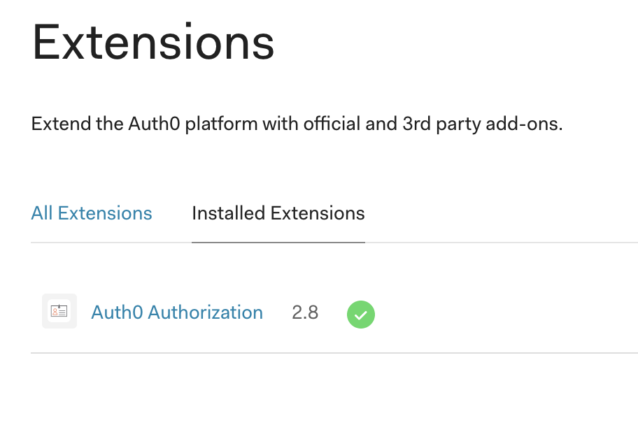

Add permissions, roles and groups.

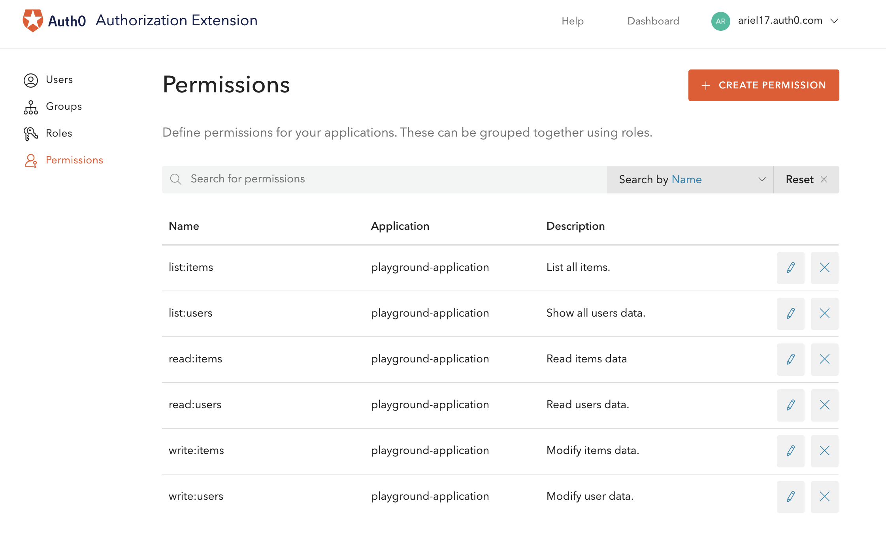
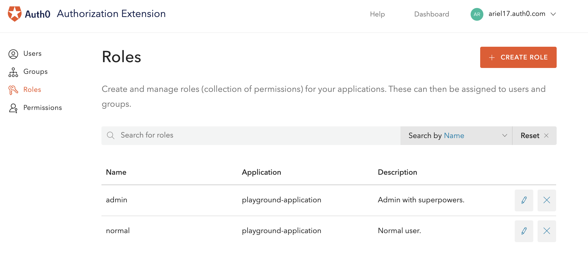
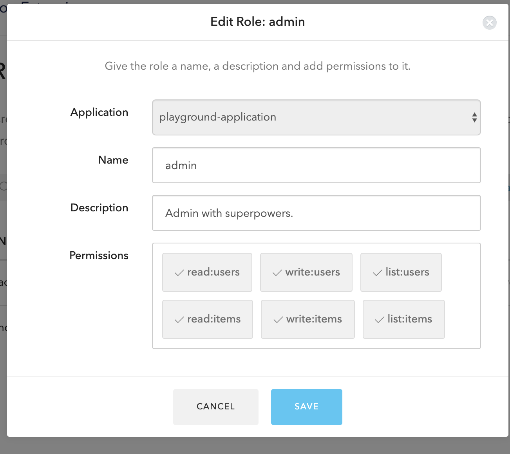
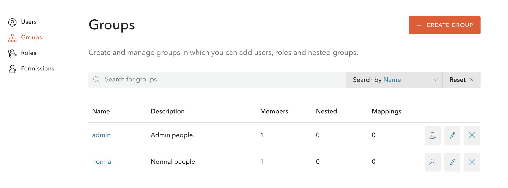
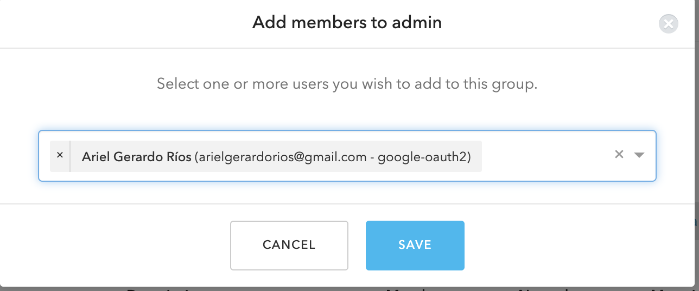

Back to Auth0 Dashboard, change the automatically added rule to store the
Authorization Extension data as metadata in token:

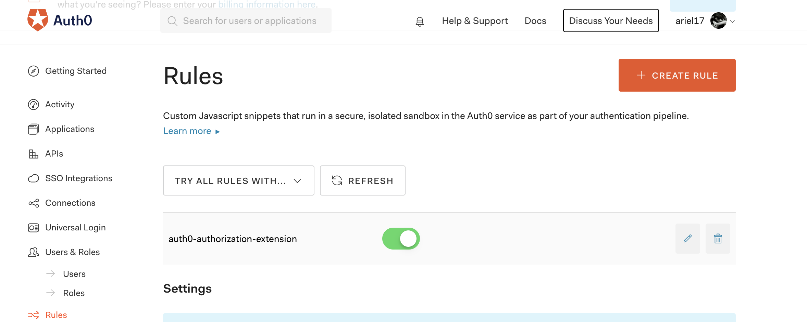

Change it to add the following lines:

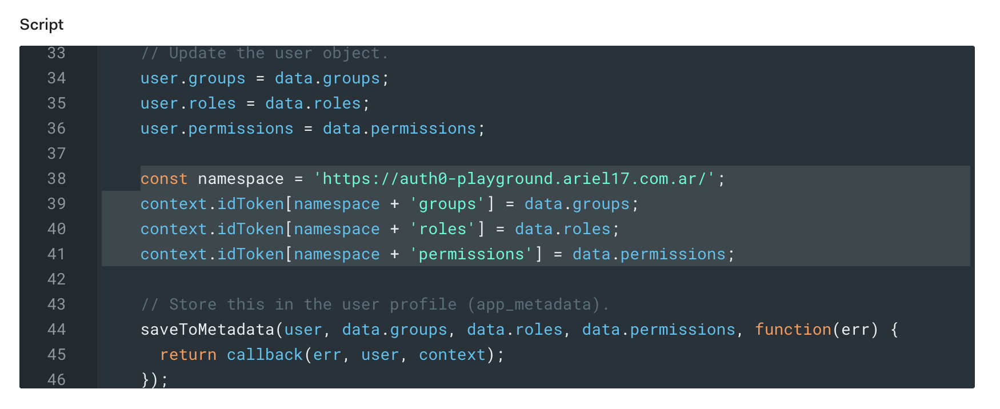

That's it, this is all what is required from Auth0. Let's go to the playground
and interact with the API using different tokens.

## API usage through Application tokens

My user is in the `admin` group, so I am able to perform any operation:


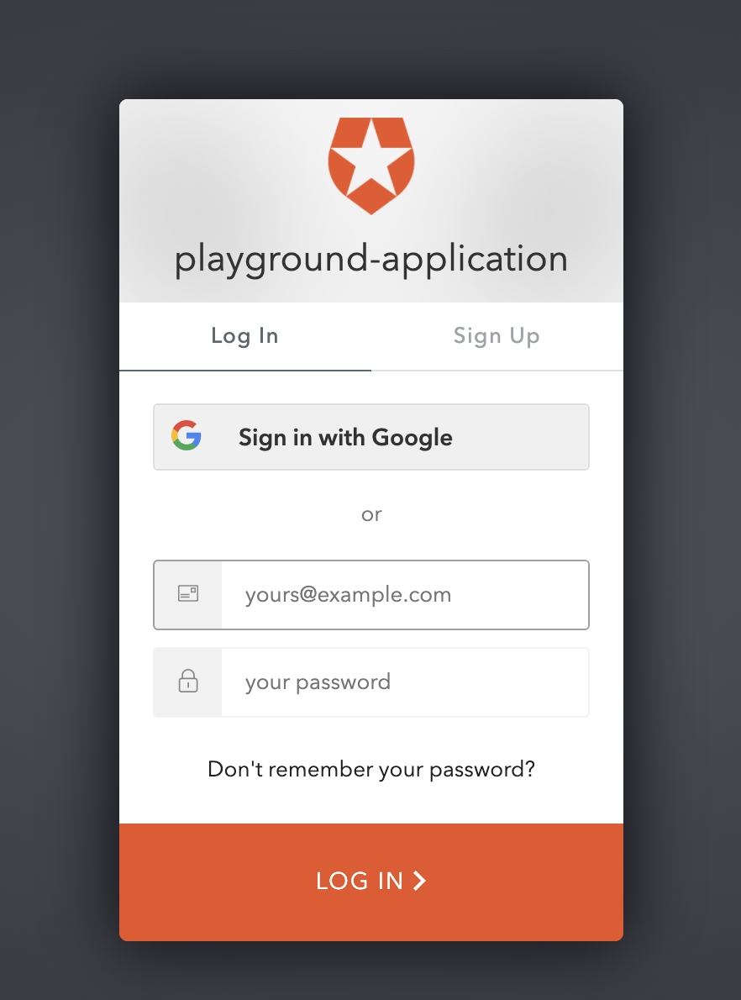
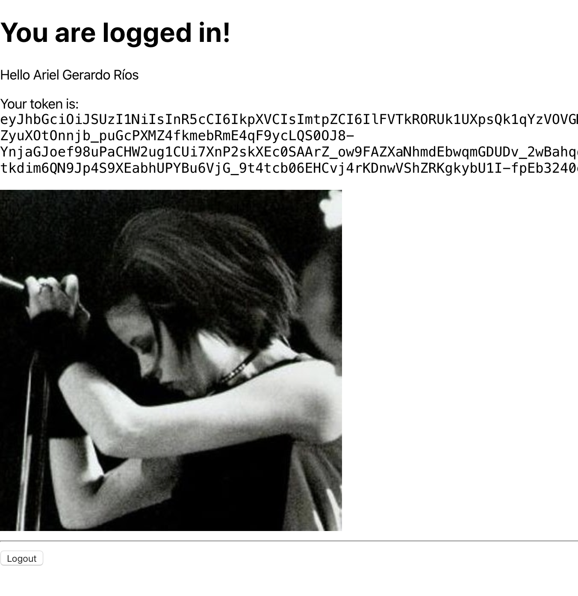

```bash
$ token="eyJhbGciOiJSUzI1NiIsInR5cCI6IkpXVCIs..."
$ curl -XPOST -H "Authorization: Bearer $token" http://localhost:8080/users/ | jq .

{
  "id": "google-oauth2|100920454653990245243",
  "email": {
    "address": "arielgerardorios@gmail.com",
    "is_verified": true
  },
  "nickname": "arielgerardorios",
  "given_name": "Ariel Gerardo",
  "family_name": "Ríos",
  "groups": [
    "admin",
    "normal"
  ],
  "permissions": [
    "read:users",
    "write:users",
    "list:users",
    "read:items",
    "write:items",
    "list:items"
  ],
  "roles": [
    "admin",
    "normal"
  ],
  "created_at": "2020-03-24T22:55:31.601673-03:00",
  "avatar_url": "https://lh3.googleusercontent.com/a-/AOh14GhdYb2klUaJZ4tOWfk6RTbmeDextN5oi1xmH_eW0g",
  "enabled": true
}

$ curl -XDELETE -H "Authorization: Bearer $token" "http://localhost:8080/users/google-oauth2|100920454653990245243" | jq .

{
  .
  .
  .
  "deleted_at": "2020-03-24T22:56:35.876572-03:00",
}
```

Adding a normal user (not admin) into the system:

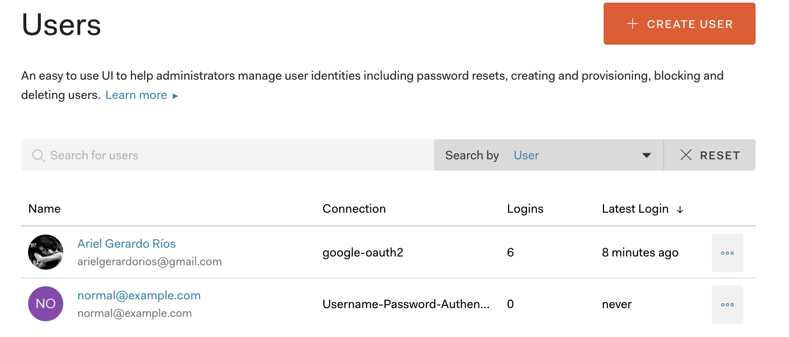
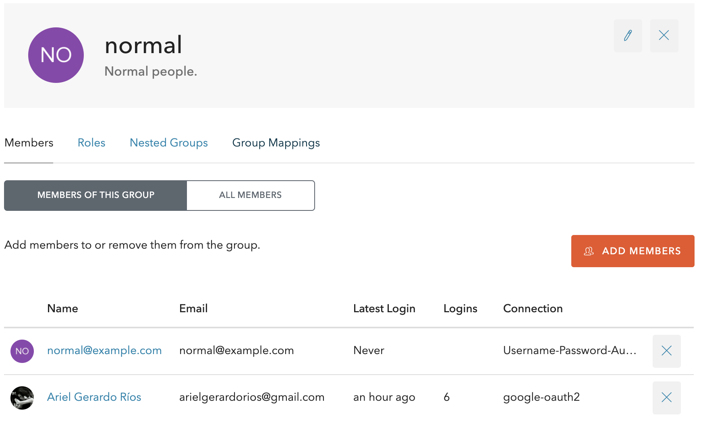
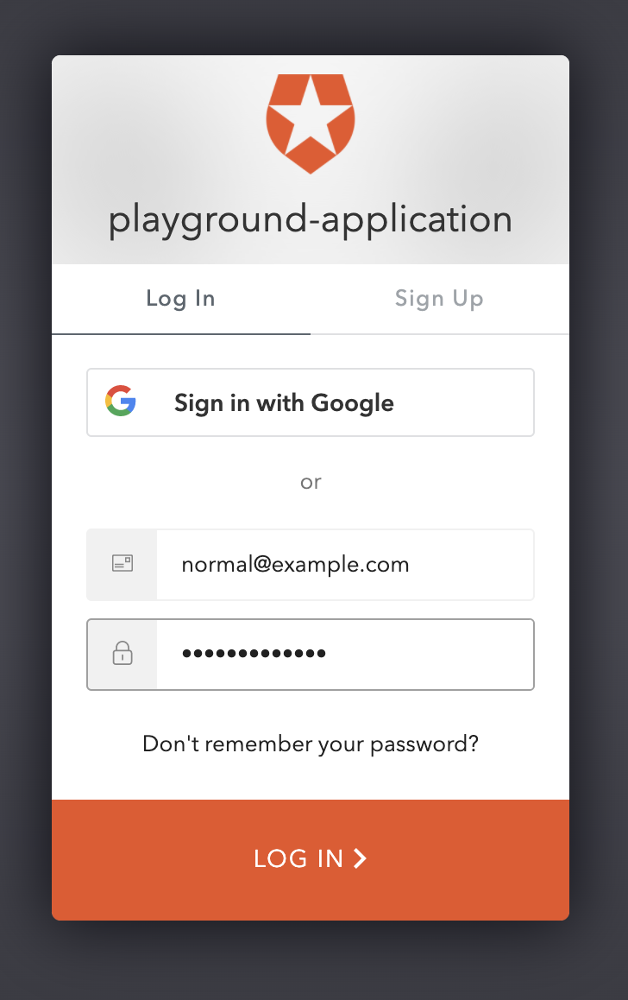
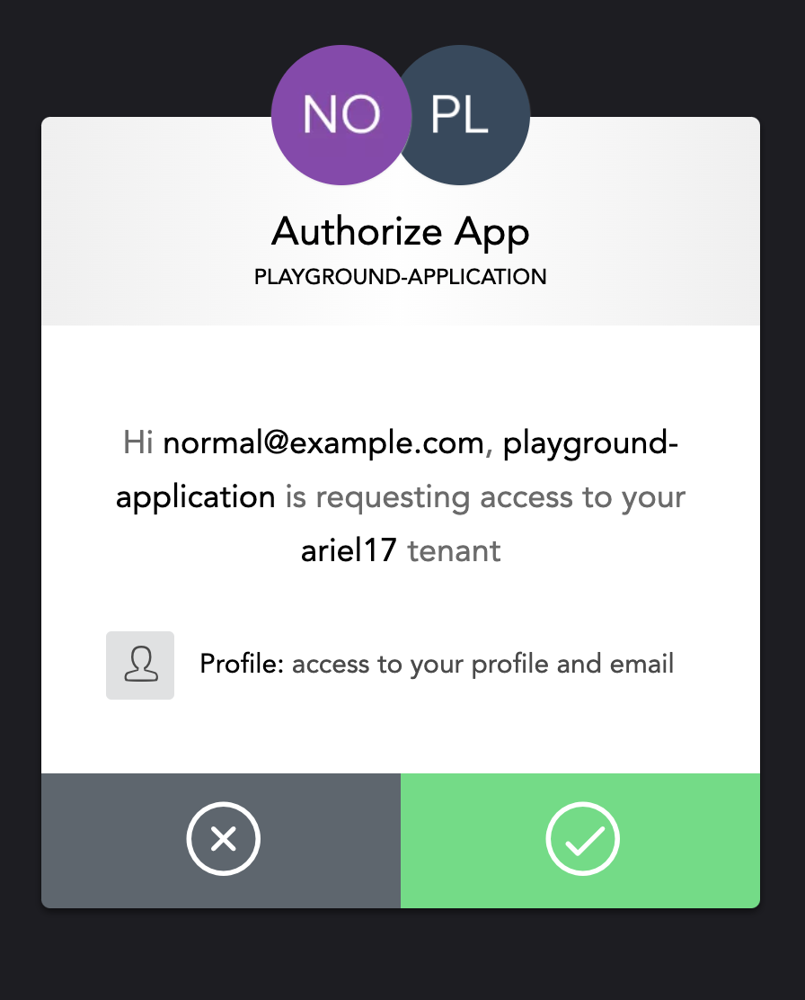
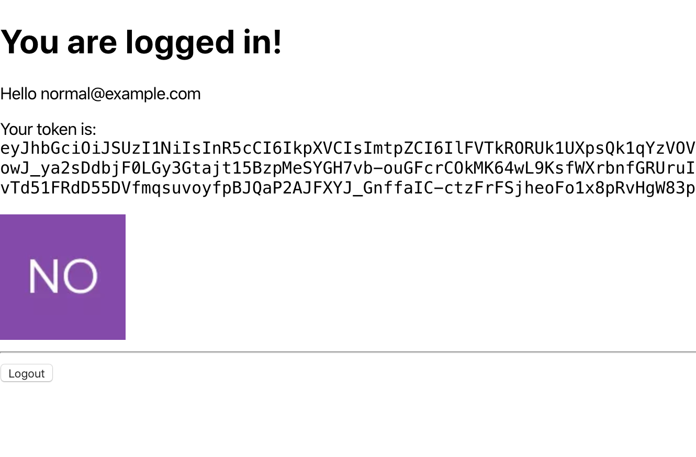

```bash
$ normal="eyJhbGciOiJSUzI1NiIsInR5cCI6IkpX..."
curl -XPOST -H "Authorization: Bearer $normal" http://localhost:8080/users/ | jq .

{
  "id": "auth0|5e7abb0918dc2d0c6a5fd8cd",
  "email": {
    "address": "normal@example.com",
    "is_verified": false
  },
  "nickname": "normal",
  "given_name": "",
  "family_name": "",
  "groups": [
    "normal"
  ],
  "permissions": [
    "read:users",
    "write:users",
    "read:items",
    "write:items",
    "list:items"
  ],
  "roles": [
    "normal"
  ],
  "created_at": "2020-03-24T23:51:36.68795-03:00",
  "avatar_url": "https://s.gravatar.com/avatar/103542704026f03053a7ae25ad2bdc95?s=480&r=pg&d=https%3A%2F%2Fcdn.auth0.com%2Favatars%2Fno.png",
  "enabled": true
}
```

Creating a item using both users. This resource only shows items belonging to 
the owner or shows all to admin users.

```bash
$ curl -XPOST -H "Authorization: Bearer $token" http://localhost:8080/items/ --data '{"name":"item admin","description":"An admin item"}' | jq .

{
  "id": "cf4f125a-2ebd-4e38-8e06-3d1625ffb100",
  "user_id": "google-oauth2|100920454653990245243",
  "name": "item admin",
  "description": "An admin item",
  "created_at": "2020-03-24T23:57:18.909182-03:00"
}

$ curl -XPOST -H "Authorization: Bearer $normal" http://localhost:8080/items/ --data '{"name":"item normal","description":"A normal item"}' | jq .

{
  "id": "c831ec8d-86e3-4fae-8883-907efcb3e34e",
  "user_id": "auth0|5e7abb0918dc2d0c6a5fd8cd",
  "name": "item normal",
  "description": "A normal item",
  "created_at": "2020-03-24T23:57:08.169533-03:00"
}

$ curl -H "Authorization: Bearer $normal" http://localhost:8080/items/ | jq .

[
  {
    "id": "c831ec8d-86e3-4fae-8883-907efcb3e34e",
    "user_id": "auth0|5e7abb0918dc2d0c6a5fd8cd",
    "name": "item normal",
    "description": "A normal item",
    "created_at": "2020-03-24T23:57:08.169533-03:00"
  }
]

$ curl -H "Authorization: Bearer $token" http://localhost:8080/items/ | jq .

[
  {
    "id": "c831ec8d-86e3-4fae-8883-907efcb3e34e",
    "user_id": "auth0|5e7abb0918dc2d0c6a5fd8cd",
    "name": "item normal",
    "description": "A normal item",
    "created_at": "2020-03-24T23:57:08.169533-03:00"
  },
  {
    "id": "cf4f125a-2ebd-4e38-8e06-3d1625ffb100",
    "user_id": "google-oauth2|100920454653990245243",
    "name": "item admin",
    "description": "An admin item",
    "created_at": "2020-03-24T23:57:18.909182-03:00"
  }
]

$ curl -XDELETE -H "Authorization: Bearer $normal" "http://localhost:8080/items/cf4f125a-2ebd-4e38-8e06-3d1625ffb100" | jq .

{
  "error": "item not found"
}

$ curl -XDELETE -H "Authorization: Bearer $token" "http://localhost:8080/items/cf4f125a-2ebd-4e38-8e06-3d1625ffb100" | jq .

{
  "id": "cf4f125a-2ebd-4e38-8e06-3d1625ffb100",
  "user_id": "google-oauth2|100920454653990245243",
  "name": "item admin",
  "description": "An admin item",
  "created_at": "2020-03-24T23:57:18.909182-03:00",
  "deleted_at": "2020-03-25T00:00:51.465669-03:00"
}

$ curl -H "Authorization: Bearer $normal" http://localhost:8080/users/ | jq .

{
  "error": "invalid permissions"
}

$

[
  {
    "id": "auth0|5e7abb0918dc2d0c6a5fd8cd",
    "email": {
      "address": "normal@example.com",
      "is_verified": false
    },
    "nickname": "normal",
    "given_name": "",
    "family_name": "",
    "groups": [
      "normal"
    ],
    "permissions": [
      "read:users",
      "write:users",
      "read:items",
      "write:items",
      "list:items"
    ],
    "roles": [
      "normal"
    ],
    "created_at": "2020-03-24T23:51:36.68795-03:00",
    "avatar_url": "https://s.gravatar.com/avatar/103542704026f03053a7ae25ad2bdc95?s=480&r=pg&d=https%3A%2F%2Fcdn.auth0.com%2Favatars%2Fno.png",
    "enabled": true
  },
  {
    "id": "google-oauth2|100920454653990245243",
    "email": {
      "address": "arielgerardorios@gmail.com",
      "is_verified": true
    },
    "nickname": "arielgerardorios",
    "given_name": "Ariel Gerardo",
    "family_name": "Ríos",
    "groups": [
      "admin",
      "normal"
    ],
    "permissions": [
      "read:users",
      "write:users",
      "list:users",
      "read:items",
      "write:items",
      "list:items"
    ],
    "roles": [
      "admin",
      "normal"
    ],
    "created_at": "2020-03-24T22:55:31.601673-03:00",
    "avatar_url": "https://lh3.googleusercontent.com/a-/AOh14GhdYb2klUaJZ4tOWfk6RTbmeDextN5oi1xmH_eW0g",
    "enabled": true
  }
]

$ curl -XDELETE -H "Authorization: Bearer $normal" "http://localhost:8080/users/google-oauth2|100920454653990245243" | jq .

{
  "error": "user not found"
}

$ curl -XDELETE -H "Authorization: Bearer $token" "http://localhost:8080/users/auth0|5e7abb0918dc2d0c6a5fd8cd" | jq .

{
  "id": "auth0|5e7abb0918dc2d0c6a5fd8cd",
  "email": {
    "address": "normal@example.com",
    "is_verified": false
  },
  "nickname": "normal",
  "given_name": "",
  "family_name": "",
  "groups": [
    "normal"
  ],
  "permissions": [
    "read:users",
    "write:users",
    "read:items",
    "write:items",
    "list:items"
  ],
  "roles": [
    "normal"
  ],
  "created_at": "2020-03-25T00:03:55.722965-03:00",
  "deleted_at": "2020-03-25T00:05:45.003588-03:00",
  "avatar_url": "https://s.gravatar.com/avatar/103542704026f03053a7ae25ad2bdc95?s=480&r=pg&d=https%3A%2F%2Fcdn.auth0.com%2Favatars%2Fno.png",
  "enabled": true
}
```

## Resources

* [Authenticating Your First React App](https://auth0.com/blog/authenticating-your-first-react-app/)
* [Find out current user name in golang server that uses Auth0](https://stackoverflow.com/questions/45239257/find-out-current-user-name-in-golang-server-that-uses-auth0)
* [odewahn/react-golang-auth0](https://github.com/odewahn/react-golang-auth0)
* [Call Your API from Your Single-Page App](https://auth0.com/docs/microsites/call-api/call-api-single-page-app)
* [SPA + API: Auth0 Configuration](https://auth0.com/docs/architecture-scenarios/spa-api/part-2)
* [User Profile Claims and the `scope` Parameter](https://auth0.com/docs/api-auth/tutorials/adoption/scope-custom-claims?_ga=2.91955164.779115028.1584866023-783797780.1584866023)
* [Authorization Extension](https://auth0.com/docs/extensions/authorization-extension/v2)
* [How to obtain id_token with auth0-spa-js](https://community.auth0.com/t/how-to-obtain-id-token-with-auth0-spa-js/27574)

[1]: https://sequencediagram.org
