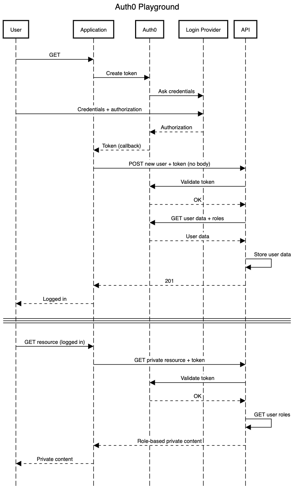
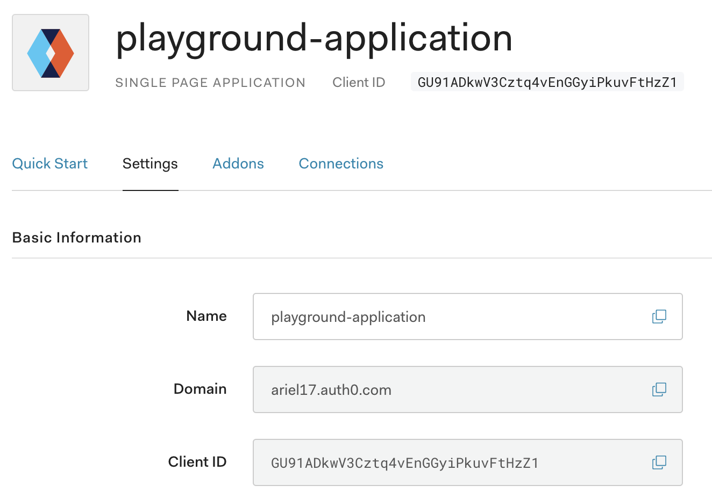
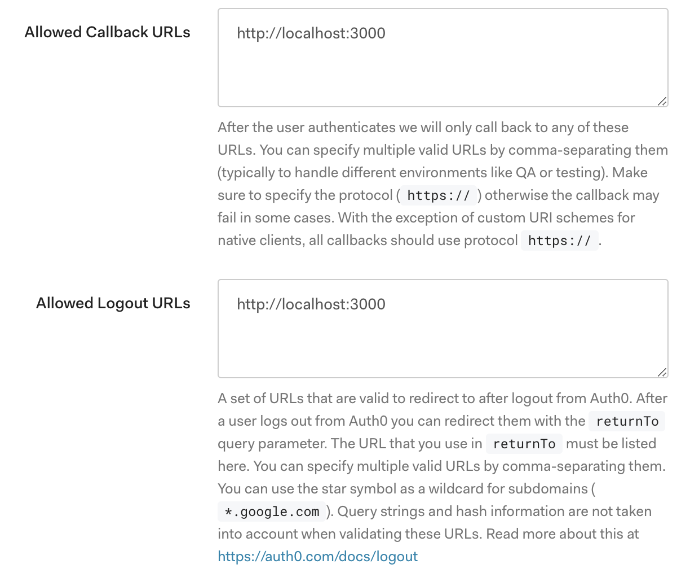

# Auth0 Playground

## What I want to do

Diagram generated with [sequencediagram.org][1].



## How to start the playground

```bash
$ docker-compose up --build  # rebuild is required when updating arguments!
```

## Application + Auth0 configuration

* Client ID represents the Auth0 application identification.
* Domain is your Auth0 tenant + Auth0 URL.




## Resources

* [Authenticating Your First React App](https://auth0.com/blog/authenticating-your-first-react-app/)

[1]: https://sequencediagram.org
