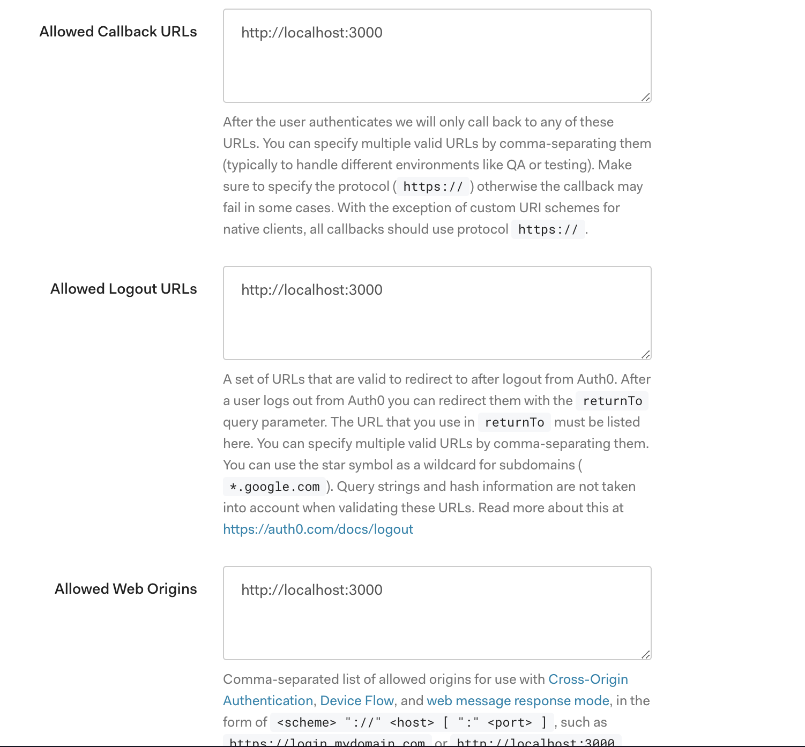

# Auth0 Playground

## What I want to do

Diagram generated with [sequencediagram.org][1].


## How to start the playground

```bash
$ docker-compose up --build  # rebuild is required when updating arguments!
```

## Application + Auth0 configuration

* Client ID represents the Auth0 application identification.
* Domain is your Auth0 tenant + Auth0 URL.




## Resources

* [Authenticating Your First React App](https://auth0.com/blog/authenticating-your-first-react-app/)
* [Find out current user name in golang server that uses Auth0](https://stackoverflow.com/questions/45239257/find-out-current-user-name-in-golang-server-that-uses-auth0)
* [odewahn/react-golang-auth0](https://github.com/odewahn/react-golang-auth0)
* [Call Your API from Your Single-Page App](https://auth0.com/docs/microsites/call-api/call-api-single-page-app)
* [SPA + API: Auth0 Configuration](https://auth0.com/docs/architecture-scenarios/spa-api/part-2)
* [User Profile Claims and the `scope` Parameter](https://auth0.com/docs/api-auth/tutorials/adoption/scope-custom-claims?_ga=2.91955164.779115028.1584866023-783797780.1584866023)
* [Authorization Extension](https://auth0.com/docs/extensions/authorization-extension/v2)
* [How to obtain id_token with auth0-spa-js](https://community.auth0.com/t/how-to-obtain-id-token-with-auth0-spa-js/27574)

[1]: https://sequencediagram.org
